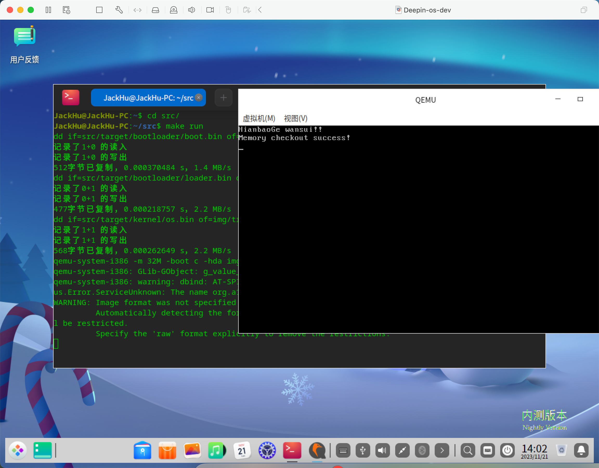

# Transistion-OS-Dev
## All in One Pre
This project belongs to <font color=red>"跨考大家庭"</font>. Everyone wants to learn it should not share it with other persons/students/people. If you did what didn't have been approved by us, we'll fight you!

Named Transistion-OS-Dev, not Transition-OS-Dev

## Environment establishment
> Machine: Deepin or Ubuntu20

```shell
sudo apt-get update
sudo apt-get install git nasm bximage gcc qemu-system-i386 qemu-utils

sudo apt-get install gdb # debug using
```
```shell
git clone git@github.com:Huzhiwen1208/Transistion-OS-Dev.git
cd Transistion-OS-Dev

make build # build project
make run # execute the project
make debug # should use vscode launch.json with gdb
```

## Development Format
1. Do use camel case with upper first, for example: `void GetNameById()`
2. Do not use <font color=green>#define</font>, instead of const, for example: `#define MAX 100` -> `const u8 MAX = 100;`
3. Do not use *int, unsigned int, long long*, etc.., instead of *i32, u32, i64*.., you will got it in type.h
4. All *.h files(in src/kernel/include/) should have corresponding *.c files with the same name
5. For ZB, we decided to use english in comment
6. Every section should have corresponding description in README, example: `Ininializing Section` below

## Initializing Section
Executing `make run` in your deepin/ubuntu(notice: not in your vscode remote, this should cause error), you have finished <font color=lightblue>Environment Establishment</font> beautifully if you get feedback like this below.


Sure, if you get error and can not solve it, try contact me with email: <font color=purple>jackhu.521.rose@gmail.com`</font>