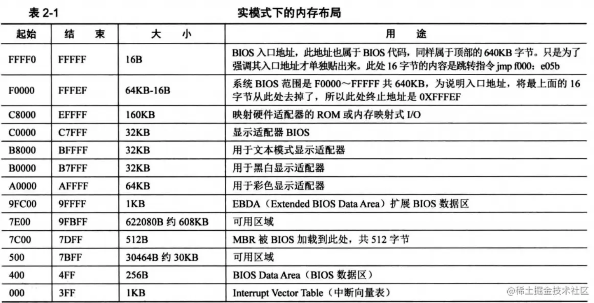
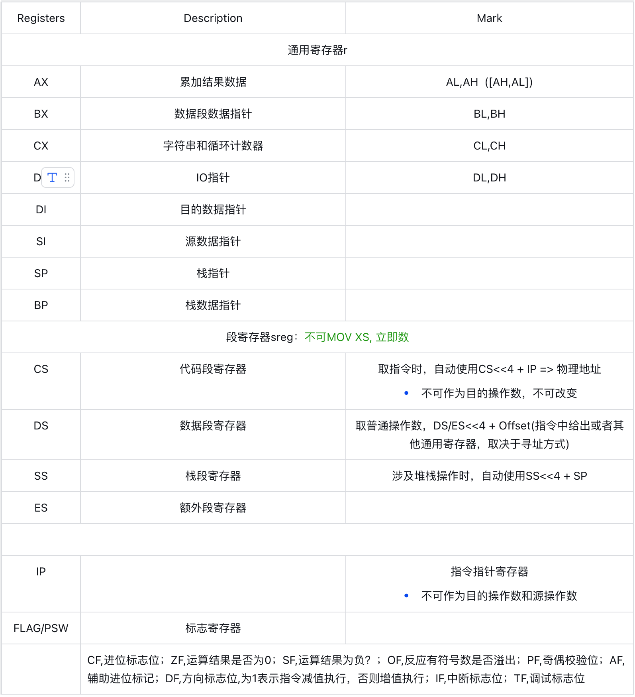
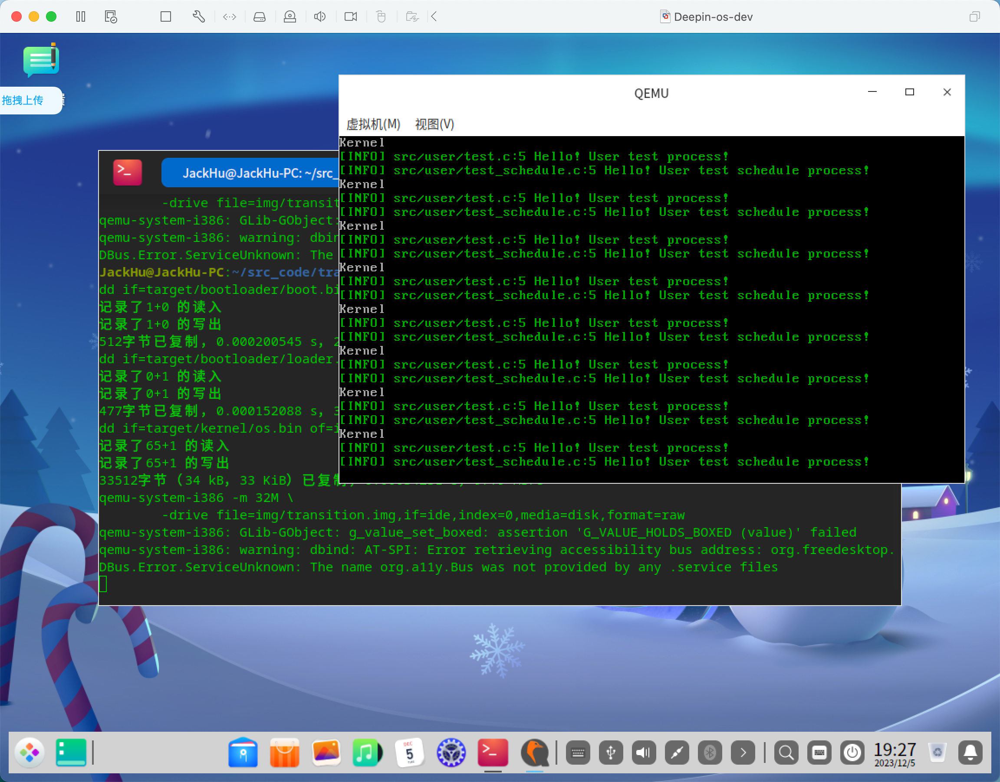

# Transition-OS-Dev
## 前情提要
- CPU：I386
- 内存：32MB
- 汇编代码：x86（NASM）+ AT&T语法格式
- 内存布局（前1MB）：
    <div align=center></div>
- 寄存器：
    <div align=center></div>
## 环境搭建
> 计算机类型: Deepin or Ubuntu20 or MacOS

```shell
sudo apt-get update
sudo apt-get install git nasm bximage gcc qemu-system-i386 qemu-utils

sudo apt-get install gdb # debug using
```
```shell
git clone git@github.com:Huzhiwen1208/Transition-OS-Dev.git
cd Transition-OS-Dev

make build # build project
make run # execute the project
make debug # should use vscode launch.json with gdb
```

## 开发说明
1. 我决定采用驼峰式的代码风格，在C语言中用驼峰式或许非常别扭，但是我还是决定用它。这有点像Java。
2. 在代码中尽量使用`const u32 MAX = 1024;`来代替宏定义`#define MAX 1024`，这样做是有缺点的，它会带来更大的运行时开销（多头文件使用）。但是可以规避`#define MAX 256 * 4`这种容易出错的定义。而且我更想做的和C语言不一样，这也是个大胆的尝试。并且把所有的常亮，枚举都抽取到`common`模块中。
3. 不使用`int, long long, unsigned int...`，而是使用`i32, i64, u32...`代替。这有点像Rust。
4. 在项目文件布局上，我采用了新的模式，每个模块`modelName`都有三个头文件`modelName.h, type.h, method.h`。其中我们只使用`modelName.h`作为导出（这有点像Rust），其内容框架是
    ```cpp
    // modelName.h
    #pragma once
    #include "type.h"
    #include "method.h"

    // type.h
    #pragma once
    #include "../common/common.h"
    /// @brief 使用到的struct类型，以及其他类型定义

    // method.h
    #pragma once
    #inlude "type.h"
    /// @brief 对外暴露的方法，功能
    ```
5. 整体的开发过程，会尽量解耦，并且采用需要什么添加什么的逻辑，所以前期可扩展性要好（虽然不是商业化工程开发）
6. 每个内容块都会单独开个分支，每个分支对应了一个README.md中的二级标题。其中所有的资源采用垂直记录。分支只能采用PR形式提交到master，并做好合并说明。我们保留每一个分支，所以在Merge时，需要Squash Commits。这样可以在master上看到有多少个模块合入，在每个具体分支上可以看Commit信息。
   - feat/xxx: 一个新的xxx功能分支开发
   - fix/xxx: 修复xxx功能或模块

## 进入内核
- 对应分支：feat/entry-kernel
- 内容概述：实现了从裸机（CPU，内存，硬盘）进入内核。
- 详情链接：[进入内核文字描述](https://m13n4gzucg.feishu.cn/docx/GXrSdE7z7ojMMFxAUA2cvXx0nVc)
  
在你的虚拟机（或者物理机，总之是你的运行代码的物理机不是远程开发机）上执行`make run`，你会看到类似下图的界面，那么恭喜你你的初始环境搭建好了。当然，如果出现难以解决的问题，请联系我的邮箱`jackhu.521.rose@gmail.com`。我会把它贴在FAQ中。如果我遇到什么问题，也会分享到FAQ中。

<div align=center></div>

## 显存控制台 & 内存管理
- 对应分支：feat/console-and-memory
- 内容概述：实现了内核控制台输出，日志输出，还进行了物理页帧分配管理器初始化，使用伙伴算法实现内核堆内存管理。
- 详情链接：[文本显存和内存管理初步](https://m13n4gzucg.feishu.cn/docx/IWXWdI8SRoaNaIxFQCrcjc3UnAe)
  
在你的虚拟机（或者物理机，总之是你的运行代码的物理机不是远程开发机）上执行`make debug`，并在`main.c`中打上断点，调试到执行完最后一行代码，查看`globalBuddyAllocator`中的结点数，如果是两个，那么恭喜你实现了输出和内存管理初步。后续会使用键盘中断实现输入。当然，如果出现难以解决的问题，请联系我的邮箱`jackhu.521.rose@gmail.com`。我会把它贴在FAQ中。如果我遇到什么问题，也会分享到FAQ中。

## 中断和特权级
- 对应分支：feat/int
- 内容概述：实现了中断处理、特权级切换以及进程管理初步。
- 详情链接：[中断和特权级](https://m13n4gzucg.feishu.cn/docx/Oe5jdGu4moidgtxgDRpc3GIqnFf)

在你的虚拟机（或者物理机，总之是你的运行代码的物理机不是远程开发机）上执行`make run`，你会看到类似下图界面，那么恭喜你实现了中断处理和特权级切换。后续会实现一些经典的系统调用。当然，如果出现难以解决的问题，请联系我的邮箱`jackhu.521.rose@gmail.com`。我会把它贴在FAQ中。如果我遇到什么问题，也会分享到FAQ中。

<div align=center></div>

## 内存映射-分页
- 对应分支：feat/mm
- 内容概述：实现了分页。
- 详情链接：[内存映射-分页](https://m13n4gzucg.feishu.cn/docx/GSqddH3aqoSOfgxR5FQcTdknnUd)

## FAQ
0. Mac和Ubuntu中的bximage命令中，需要使用-func代替-mode来创建硬盘，而Deepin只需要使用-mode选项。
1. 在本操作系统开发中，我们关闭了所有的warning（据说linux开发把所有的warning看成error）。并且数组下标越界是没有Warning和Error的，所以在开发中如果出现了下标越界，可能访问到其他我们并不想读/写的数据，所以需要严谨对待数组下标越界。
2. 在Deepin系统中GDB无法进入汇编代码单步调试，经调研发现GDB版本比较旧，但是Deepin并不支持源码安装的高版本GDB。所以使用了mac版的Makefile，只需要在macOS执行`make debug-mac`即可在Mac上进行汇编单步调试。
3. 如果不显式的加载TSS段，而只是简单的放在GDT中，CPU会找不到TSS位置，从而在用户态系统调用时会导致TSS invalid之类的错误。
